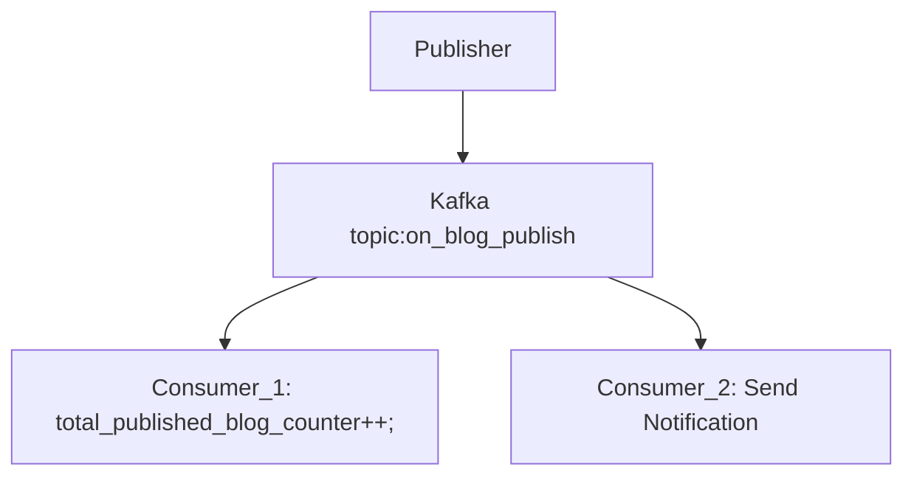
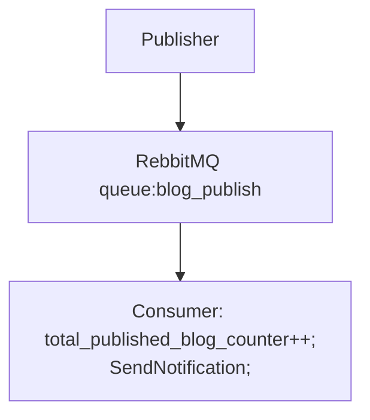

| #            | RebbitMQ                                  | Kafka                                                         |
| ------------ | ----------------------------------------- | ------------------------------------------------------------- |
| Storage      | In Memory Message Broker                  | Log Based Message Broker                                      |
| Scalability  | No Limitation                             | Processing Limitation = Number of Partition                   |
| Sequence     | Not Preserved                             | Preserved (per partition)                                     |
| Ideology     | Consumer Centric (one consumer per topic) | Publisher Centric (one publisher per topic)                   |
| Message Push | RebbitMQ can push message to consumer     | Kafka can't push message to consumer                          |
| Flexibility  | Flexible                                  | Scale down from N partition to N-1 partition is not possible. |
| Velocity     | Fast                                      | Slow                                                          |
| Replay       | NA                                        | Possible                                                      |

>Kafka

>RebbitMQ
