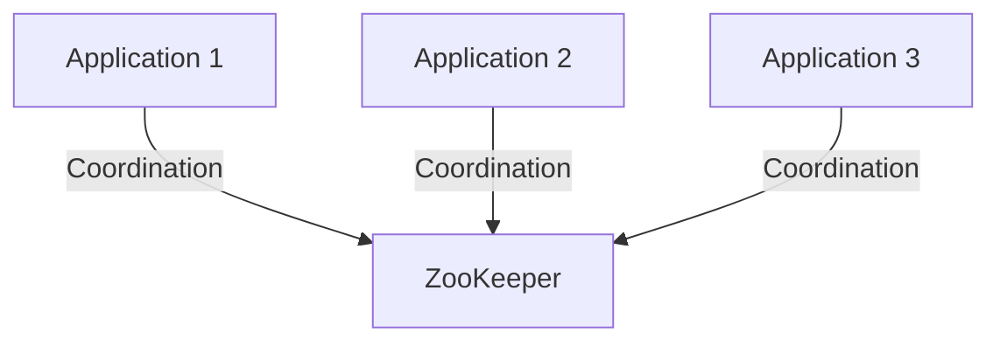
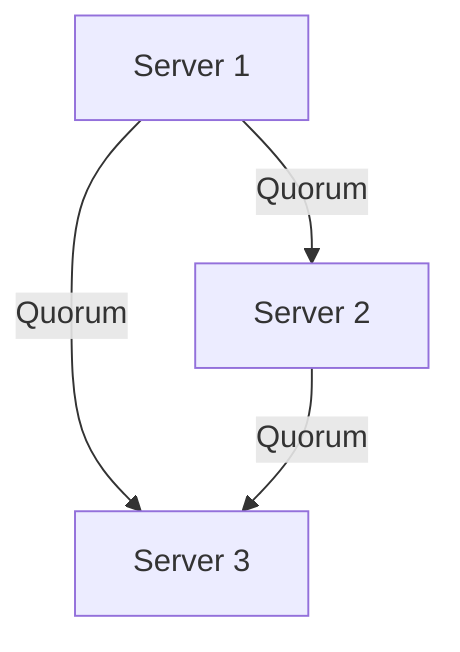
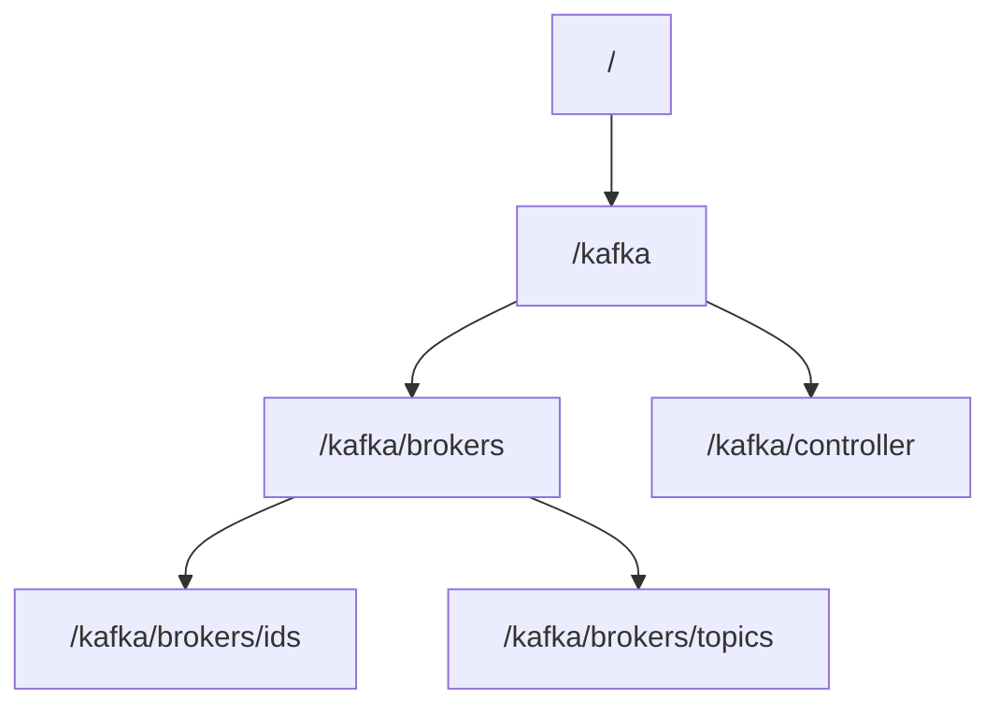
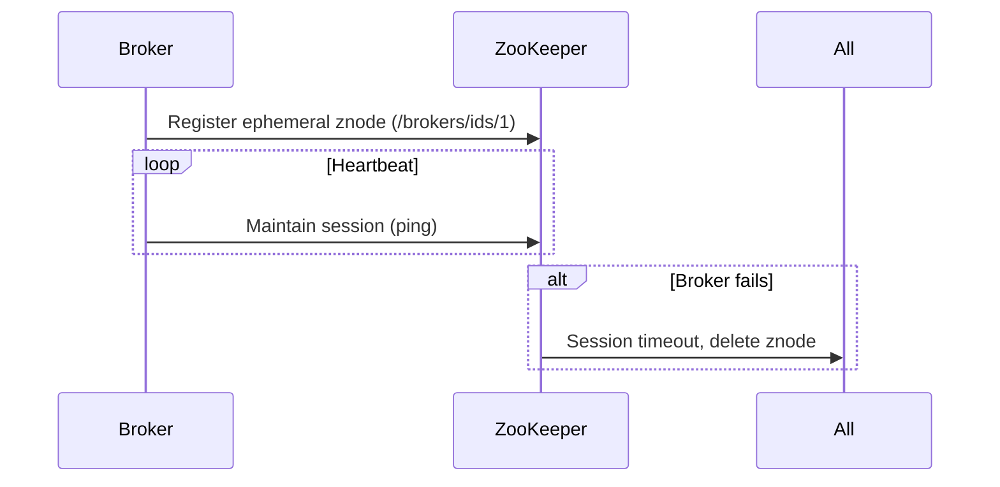
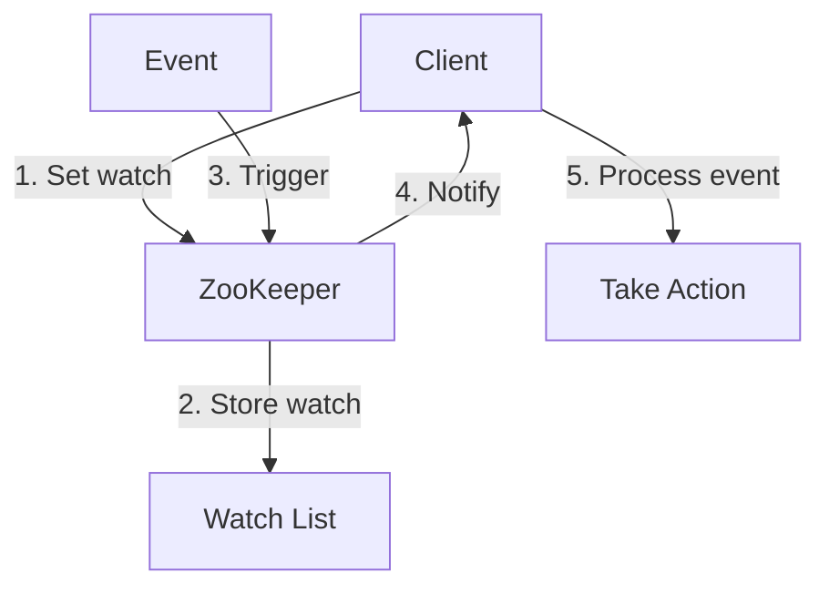
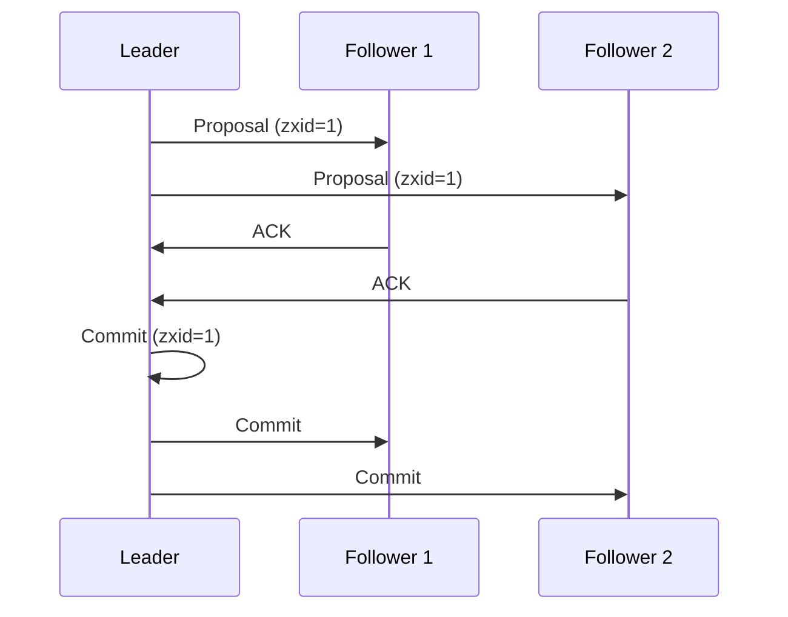
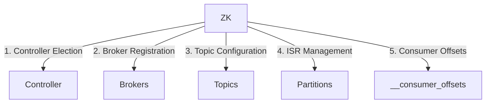

## 1. Fundamental Concepts

ZooKeeper is a **centralized coordination service** that helps distributed systems maintain configuration information, provide distributed synchronization, and enable group services. It acts as the "source of truth" for systems like Kafka.



## 2. Core Architecture

### 2.1 Server Ensemble
ZooKeeper runs as an **ensemble** (cluster) of servers:



**Key Points:**
- Typically 3 or 5 servers (always odd number)
- Requires majority (quorum) to operate (2 of 3, 3 of 5)
- One server elected as leader, others as followers
- All writes go through leader, reads can go to any server

### 2.2 Data Model: The ZNode Hierarchy
ZooKeeper stores data in a **znode hierarchy** (like a file system):



**ZNode Types:**
1. **Persistent**: Survive client disconnections (e.g., configuration)
2. **Ephemeral**: Exist only during client session (e.g., broker registrations)
3. **Sequential**: Automatically append counter (e.g., for leader election)

## 3. How ZooKeeper Works in Kafka

### 3.1 Cluster Coordination


**Explanation:**
- Brokers register ephemeral znodes on startup
- Regular heartbeats maintain the session
- If broker fails, session times out and znode disappears
- Kafka controller detects changes and triggers rebalance

### 3.2 Leader Election
```mermaid
sequenceDiagram
    participant B1 as Broker 1
    participant B2 as Broker 2
    participant B3 as Broker 3
    participant ZK as ZooKeeper
    
    B1->>ZK: Create /controller (first wins)
    ZK-->>B1: Success (becomes controller)
    B2->>ZK: Create /controller (fails, exists)
    B3->>ZK: Create /controller (fails, exists)
    Note over B1: Controller responsibilities
    alt Controller fails
        ZK->>B2,B3: /controller deleted
        B2->>ZK: Create /controller (new election)
    end
```

**Explanation:**
- First broker to create /controller becomes leader
- Other brokers watch this znode for changes
- If controller fails, znode disappears triggering new election
- New controller takes over cluster management

## 4. Key Mechanisms

### 4.1 Watch Notifications


**Watch Types:**
- NodeCreated, NodeDeleted, NodeDataChanged, NodeChildrenChanged

### 4.2 Zab Protocol (Atomic Broadcast)


**Key Properties:**
- **ZooKeeper Atomic Broadcast** ensures ordered delivery
- **Zxid** (Transaction ID) provides total ordering
- Requires quorum ACKs before commit
- Guarantees consistency across ensemble

## 5. Kafka-Specific Usage

### 5.1 Critical Paths in Kafka


**Modern Kafka Note:** Newer versions are reducing ZooKeeper dependency, with:
- KRaft protocol for metadata management (Kafka 3.4+)
- __consumer_offsets topic instead of ZooKeeper
- Direct RPC for controller communication

## 6. Why ZooKeeper Works for Kafka

1. **Consistency Guarantees**:
   - Sequential consistency from Zab protocol
   - Linearizable writes (all servers see same order)

2. **Performance Characteristics**:
   ```mermaid
   pie
       title ZooKeeper Workload
       "Reads" : 70
       "Writes" : 30
   ```
   - Optimized for read-heavy workloads
   - Writes are slower (require quorum)

3. **Failure Handling**:
   ```mermaid
   stateDiagram-v2
       [*] --> Follower
       Follower --> Leader: Election
       Leader --> Follower: Failure
       Follower --> Recovering: Restart
       Recovering --> Follower: Sync complete
   ```
   - Automatic failover
   - Fast recovery (seconds not minutes)
   - No data loss once committed

ZooKeeper provides Kafka with the essential "coordination kernel" needed for its distributed operations, though newer Kafka versions are evolving to reduce this dependency while maintaining the same consistency guarantees.