# 1. Overview  
  
## 1.1 System Purpose and Key Components Diagram  
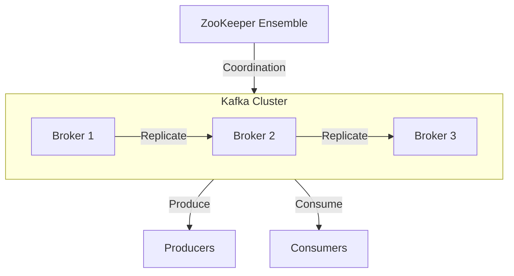
  
Explanation:  
- Shows Kafka's fundamental architecture with ZooKeeper for coordination  
- Producers publish messages to the Kafka cluster  
- Consumers subscribe to topics and consume messages  
- Brokers form the cluster and replicate data between them
- ZooKeeper maintains cluster metadata and controller election   
# 2. High Level Design  
  
## 2.1 Multi-Cluster Architecture Diagram  
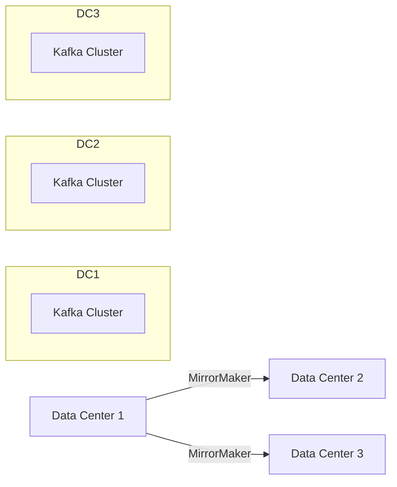
  
Explanation:  
- Illustrates geo-redundant deployment across multiple data centers  
- MirrorMaker replicates data between clusters for disaster recovery  
- Each data center has its own independent Kafka cluster  
- Enables active-active or active-passive configurations  
  
## 2.2 Component Relationships Diagram  
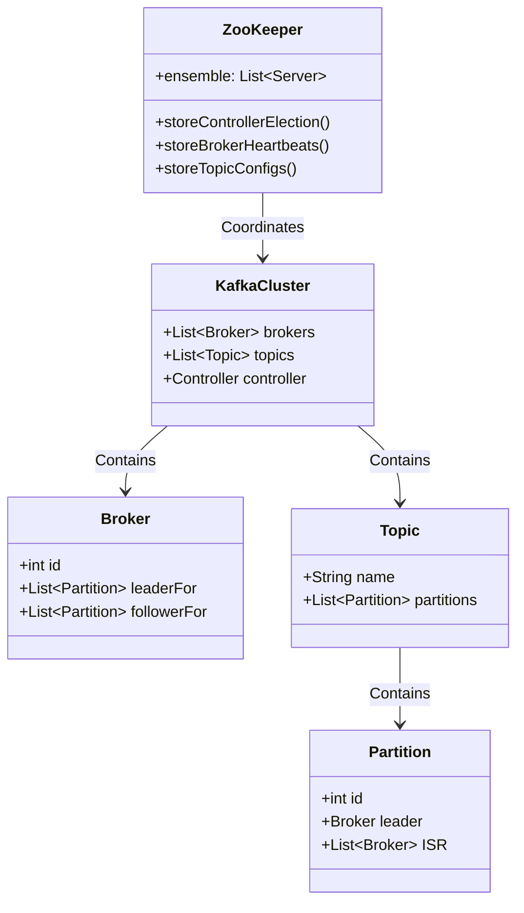
  
Explanation:  
- ZooKeeper class shows its critical coordination functions  
- KafkaCluster contains all brokers and topics  
- Each broker tracks which partitions it leads/follows  
- Topics contain partitions which have leader/follower relationships  
- ISR (In-Sync Replicas) maintains list of up-to-date followers  
  
# 3. Low Level Design  
  
## 3.1 ZooKeeper Ensemble Diagram  
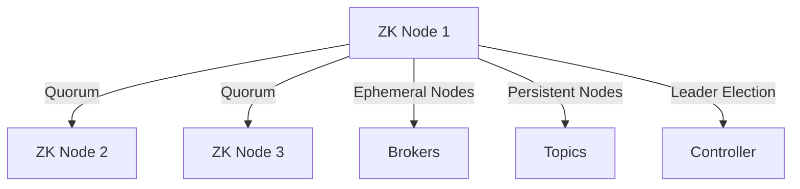
  
Explanation:  
- ZooKeeper runs in odd-numbered ensembles (typically 3 or 5 nodes)  
- Uses quorum for consensus and fault tolerance  
- Ephemeral nodes track live brokers (disappear if broker fails)  
- Persistent nodes store topic configurations  
- Manages controller election for cluster coordination  
  
## 3.2 Partition Distribution Diagram  
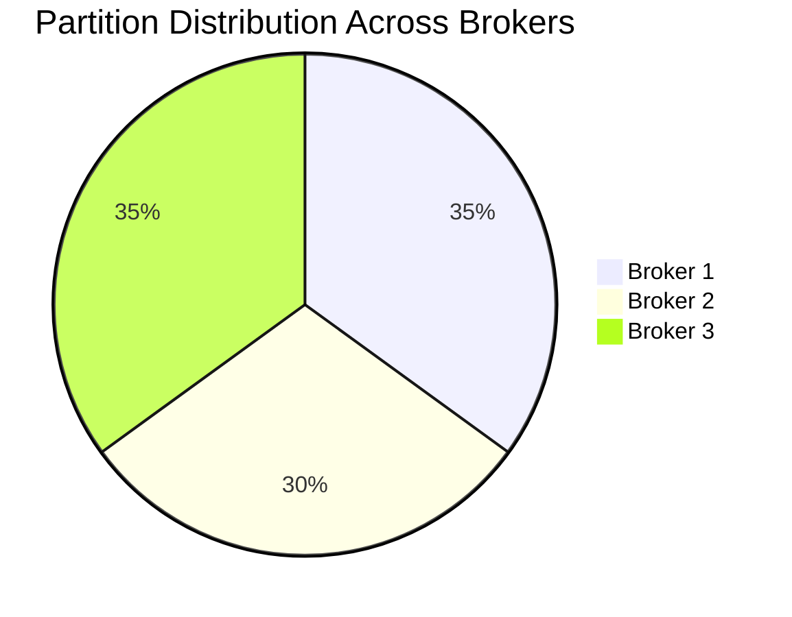
  
Explanation:  
- Shows how partitions are distributed across brokers  
- Kafka aims for even distribution of leadership  
- Ensures no single broker becomes a bottleneck  
- Rebalancing occurs when brokers join/leave the cluster  
  
## 3.3 Replication Mechanism Diagram  
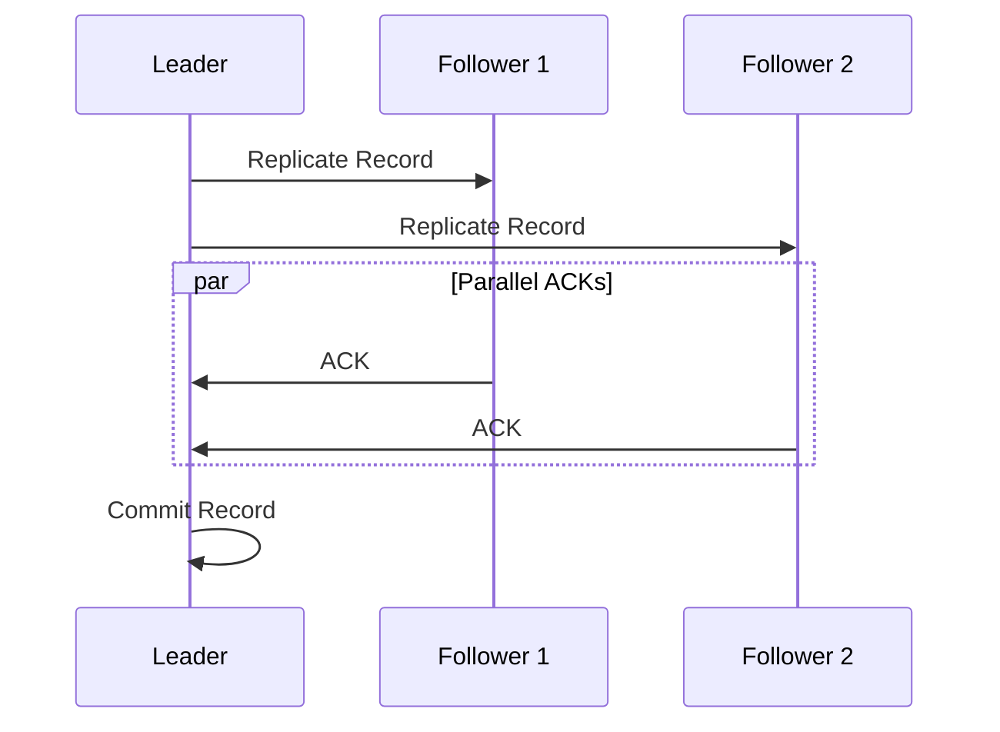
  
Explanation:  
- Leader replicates records to all followers in parallel  
- Followers acknowledge successful writes  
- Leader commits only after receiving required ACKs (configurable)  
- Implements Kafka's durability guarantees  
  
# 4. Data Flow Discussion  
  
## 4.1 Producer Flow Diagram  
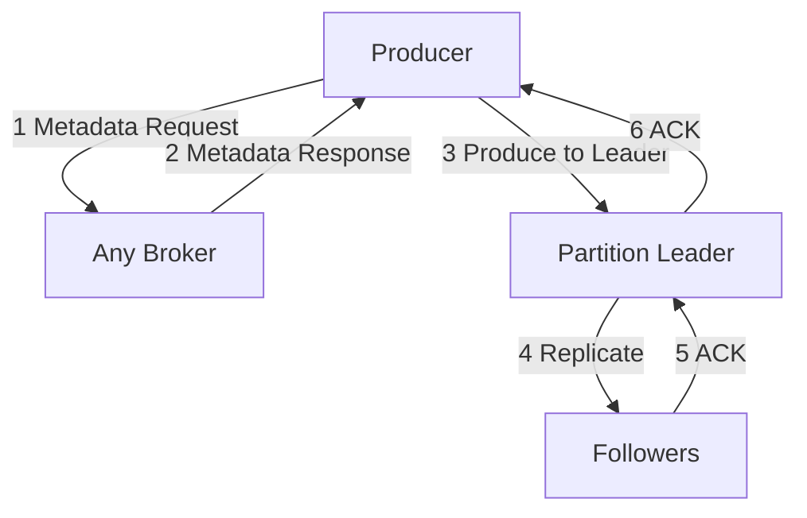
  
Explanation:  
1. Producer first fetches metadata to discover partition leaders  
2. Broker responds with current cluster metadata  
3. Producer sends records directly to partition leaders  
4. Leader replicates to followers (based on replication factor)  
5. Followers acknowledge successful replication  
6. Leader acknowledges back to producer  
  
## 4.2 Consumer Flow Diagram  
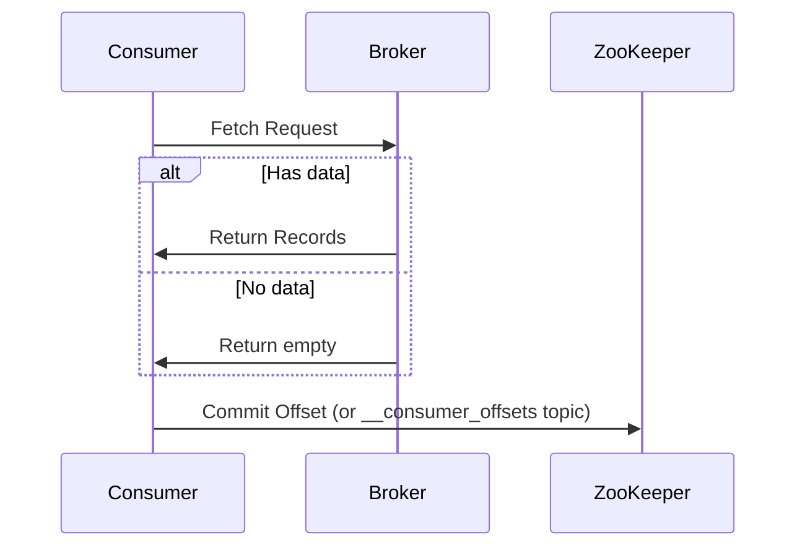
  
Explanation:  
- Consumers periodically fetch records from brokers  
- Brokers return available records or empty response  
- Consumers commit their offsets to track consumption progress  
- Modern Kafka versions use internal topic (`__consumer_offsets`) instead of ZooKeeper  
  
## 4.3 Controller Failover Diagram  
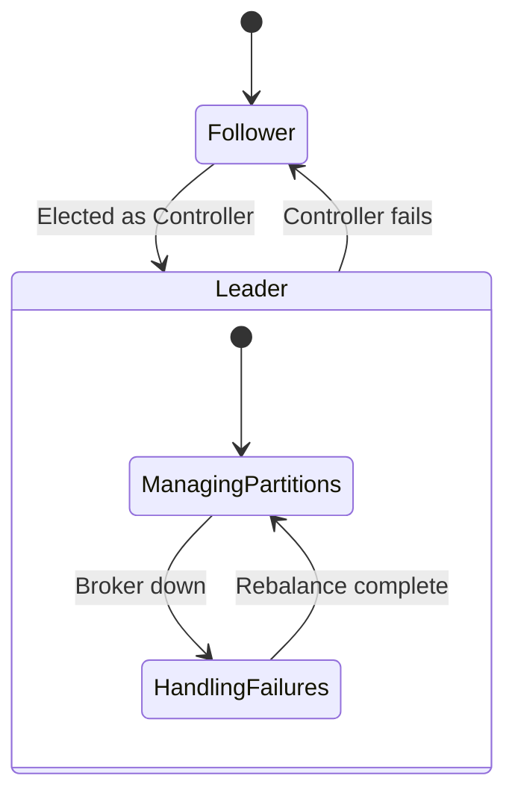
  
Explanation:  
- Shows controller failover state machine  
- Only one broker acts as controller at a time  
- Controller manages partition leadership and ISR changes  
- If controller fails, new election occurs automatically  
- Controller handles partition reassignment during failures  
  
# 5. Cluster Synchronisation (MirrorMaker) Diagram  
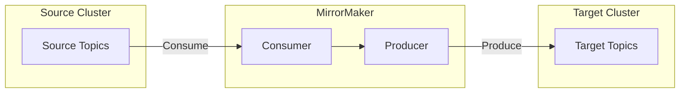
  
Explanation:  
- MirrorMaker bridges two Kafka clusters  
- Consumer group reads from source cluster  
- Producer writes to target cluster  
- Maintains message ordering within partitions  
- Can be configured for active-active or active-passive  
  
# 6. Fault Tolerance Scenarios  
  
## 6.1 Broker Failure Diagram  
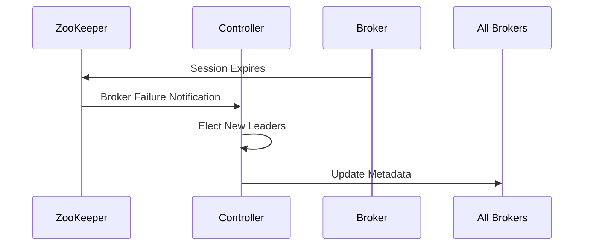
  
Explanation:  
- When broker fails, ZooKeeper session expires  
- Controller receives failure notification  
- Controller reassigns leadership for affected partitions
- Updates metadata propagated to all brokers
- Producers/consumers get new metadata on next request  
  
## 6.2 Network Partition Diagram  
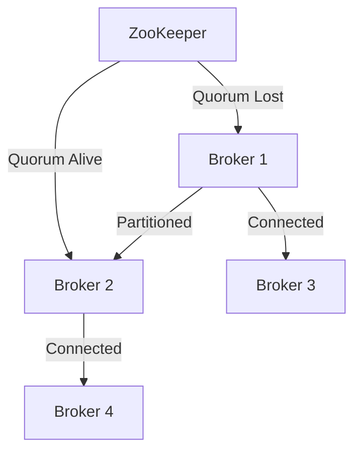
  
Explanation:  
- Shows split-brain scenario in network partition
- ZooKeeper maintains quorum on majority side
- Partitioned brokers may be marked offline
- Kafka prioritizes consistency over availability in partitions  
  
# 7. Performance Considerations  
  
## 7.1 Partition Rebalancing Diagram  
```mermaid  
gantt  
    title Partition Rebalance During Scaling  
    dateFormat  HH:mm  
    section Add Broker  
    Rebalance Partitions :active, 00:00, 5m  
    section Remove Broker  
    Replicate Partitions :crit, 00:05, 10m  
```  
  
Explanation:  
- Adding brokers triggers partition rebalancing  
- Removing brokers requires partition replication  
- Critical operation to maintain availability  
- Time varies based on partition size and count  
  
## 7.2 Resource Allocation Diagram  
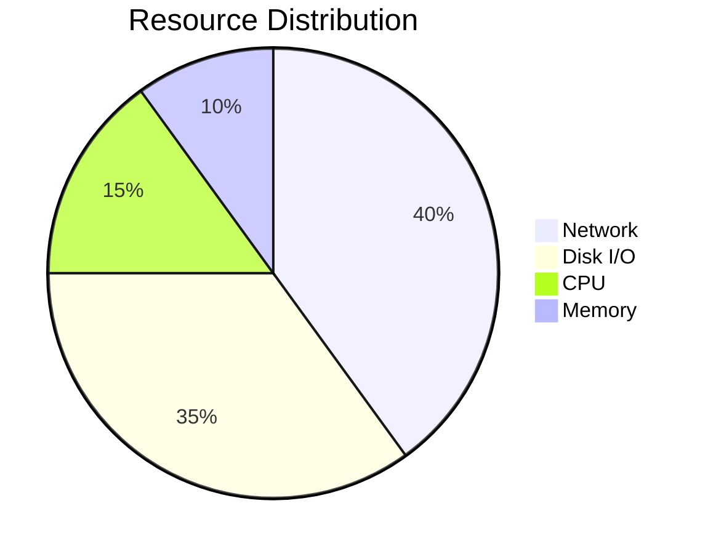
  
Explanation:  
- Network bandwidth is primary bottleneck  
- Disk throughput critical for message persistence  
- CPU for compression/encryption (if used)  
- Memory mainly for page cache (not JVM heap)  

Each diagram in this document visually explains a critical aspect of Kafka's architecture, accompanied by detailed textual explanations of the components and their interactions. The combination provides a comprehensive understanding of Kafka's distributed systems design.