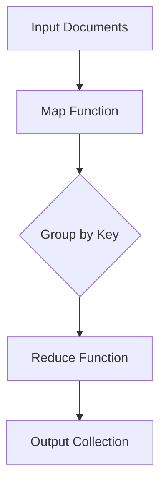
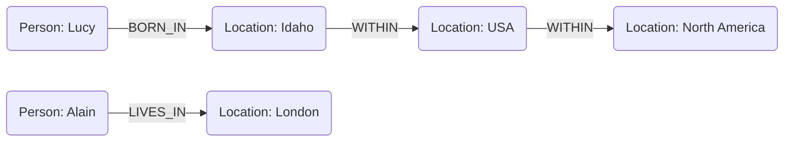

# Relational Model Versus Document Model
## 1. Relational Model Overview  
- Origins: Proposed by Edgar Codd in 1970, based on relations (tables) containing tuples (rows).  
- Adoption: By the 1980s, RDBMS (e.g., SQL-based systems) became dominant for structured data storage.  
- Use Cases: Initially for business data processing (transactions, payroll, inventory).  
- Key Advantage: Hides implementation details behind a clean interface, unlike earlier models (network/hierarchical).  

## 2. Competing Data Models  
- Alternatives: Network & hierarchical models (1970s–80s), object databases (1990s), XML databases (2000s).  
- Outcome: Relational databases generalized well beyond business use (e.g., web apps, social networks).  

## 3. The Rise of NoSQL  
- Origin: Term coined in 2009 as a hashtag for nonrelational databases.  
- Drivers:  
  - Scalability (large datasets, high write throughput).  
  - Preference for open-source software.  
  - Need for specialized queries not supported by SQL.  
  - Desire for dynamic schemas.  
- Polyglot Persistence: Use of both relational and NoSQL databases where appropriate.  

## 4. Object-Relational Mismatch  
- Impedance Mismatch: Disconnect between object-oriented code and relational tables.  
- Workarounds: ORMs (e.g., Hibernate) reduce boilerplate but don’t fully resolve the issue.  
- Example: Representing a résumé (LinkedIn profile) in SQL vs. JSON (Figure 2-1 vs. Example 2-1).  
  - SQL: Normalized tables with joins (users, positions, education).  
  - JSON: Self-contained document with nested structures (better locality, single query).  

## 5. Many-to-One and Many-to-Many Relationships  
- Normalization: Avoids duplication (e.g., storing `region_id` instead of "Greater Seattle Area").  
- Document Model Weakness: Joins are awkward (often emulated in application code).  
- Example Extensions:  
  - Organizations/schools as entities (Figure 2-3).  
  - User recommendations (Figure 2-4).  

## 6. Historical Context: Hierarchical vs. Relational Models  
- IMS (1960s): Hierarchical model (similar to JSON), struggled with many-to-many relationships.  
- CODASYL/Network Model: Records with multiple parents, but complex manual access paths.  
- Relational Breakthrough: Simplicity (tables + joins), optimized queries, and schema flexibility.  

## 7. Comparison of Document vs. Relational Databases  
- Document Advantages:  
  - Schema Flexibility: Schema-on-read (implicit, dynamic) vs. schema-on-write (explicit, static).  
  - Locality: Single read fetches nested data (good for self-contained documents).  
  - Closer to Application Structures: Reduces translation layers.  
- Relational Advantages:  
  - Joins: Efficient handling of many-to-many relationships.  
  - Mature Tooling: Query optimizers, indexing, and integrity constraints.  

## 8. Schema Flexibility  
- Document Databases: Schemaless (schema-on-read); easy to evolve but no enforcement.  
- Schema Migration:  
  - Document Approach: Application handles old/new formats (e.g., splitting `name` into `first_name`).  
  - Relational Approach: `ALTER TABLE` + `UPDATE` (slower for large datasets).  

## 9. Data Locality  
- Document Storage: JSON/XML stored contiguously (fast for full-document access).  
- Limitations: Wasted bandwidth if only part of the document is needed; large documents problematic.  

## 10. Convergence of Models  
- Relational Databases: Added JSON/XML support (PostgreSQL, MySQL).  
- Document Databases: Added join-like features (RethinkDB, MongoDB references).  
- Future: Hybrid models (e.g., relational + document) may dominate.  

## Key Takeaways  
- Use Document DBs for tree-like, self-contained data (e.g., profiles, catalogs).  
- Use Relational DBs for interconnected data requiring joins.  
- Trend: Blurring boundaries between models; best choice depends on application needs.  

# Query Languages for Data
## 1. Declarative vs. Imperative Query Languages  
- Imperative Approach (e.g., JavaScript, IMS, CODASYL):  
  - Specifies how to retrieve data (step-by-step instructions).  
  - Example:  
    ```javascript
    function getSharks() {
      var sharks = [];
      for (var i = 0; i < animals.length; i++) {
        if (animals[i].family === "Sharks") {
          sharks.push(animals[i]);
        }
      }
      return sharks;
    }
    ```  
  - Disadvantages:  
    - Verbose, harder to optimize.  
    - Order-dependent, harder to parallelize.  

- Declarative Approach (e.g., SQL, CSS, XSL):  
  - Specifies what data to retrieve (pattern/conditions).  
  - Example (SQL):  
    ```sql
    SELECT * FROM animals WHERE family = 'Sharks';
    ```  
  - Advantages:  
    - Concise, hides implementation details.  
    - Enables automatic optimizations (e.g., indexing, parallel execution).  

## 2. Declarative Queries Beyond Databases (Web Example)  
- CSS (Declarative):  
  ```css
  li.selected > p { background-color: blue; }
  ```  
  - Browser handles updates efficiently (e.g., removing `.selected`).  

- Imperative JavaScript (DOM Manipulation):  
  ```javascript
  // Cumbersome, error-prone, and breaks if DOM changes
  var liElements = document.getElementsByTagName("li");
  for (var i = 0; i < liElements.length; i++) {
    if (liElements[i].className === "selected") {
      var children = liElements[i].childNodes;
      for (var j = 0; j < children.length; j++) {
        if (child.nodeType === Node.ELEMENT_NODE && child.tagName === "P") {
          child.setAttribute("style", "background-color: blue");
        }
      }
    }
  }
  ```  

## 3. MapReduce: A Hybrid Approach  
- Definition:  
  - A programming model for distributed data processing (e.g., MongoDB, CouchDB).  
  - Combines map (filter/transform) and reduce (aggregate) functions.  

- Example (Shark Sightings per Month):  
  - SQL (PostgreSQL):  
    ```sql
    SELECT date_trunc('month', observation_timestamp) AS observation_month,
           sum(num_animals) AS total_animals
    FROM observations
    WHERE family = 'Sharks'
    GROUP BY observation_month;
    ```  
  - MongoDB MapReduce:  
    ```javascript
    db.observations.mapReduce(
      function map() {
        var year = this.observationTimestamp.getFullYear();
        var month = this.observationTimestamp.getMonth() + 1;
        emit(year + "-" + month, this.numAnimals);
      },
      function reduce(key, values) {
        return Array.sum(values);
      },
      { query: { family: "Sharks" }, out: "monthlySharkReport" }
    );
    ```  
  - How It Works:  
    1. `map` emits key-value pairs (e.g., `("1995-12", 3)`).  
    2. `reduce` sums values for each key (e.g., `reduce("1995-12", [3, 4]) → 7`).  

- Limitations:  
  - Requires writing coordinated functions.  
  - Less optimizable than declarative queries.  

## 4. MongoDB’s Aggregation Pipeline (Declarative Alternative)  
- Example:  
  ```javascript
  db.observations.aggregate([
    { $match: { family: "Sharks" } },
    { $group: {
      _id: {
        year: { $year: "$observationTimestamp" },
        month: { $month: "$observationTimestamp" }
      },
      totalAnimals: { $sum: "$numAnimals" }
    }}
  ]);
  ```  
- Advantages:  
  - SQL-like expressiveness with JSON syntax.  
  - Better optimization than MapReduce.  

## Key Takeaways  
- Declarative languages (SQL, CSS) simplify code and enable optimizations.  
- Imperative code is flexible but harder to maintain and optimize.  
- MapReduce offers distributed processing but is lower-level than SQL.  
- Modern NoSQL systems (e.g., MongoDB) reintroduce declarative queries (e.g., aggregation pipeline).  

### Mermaid Diagram: MapReduce Flow  


Explanation:  
1. Map: Processes each document, emits `(key, value)` pairs.  
2. Group: Pairs with the same key are grouped.  
3. Reduce: Aggregates values per key.  
4. Output: Results stored in a new collection.  


# Graph-Like Data Models
## 1. Introduction to Graph Models
- Purpose: Ideal for many-to-many relationships, unlike document/relational models which handle simpler hierarchies.
- Components:
  - Vertices (Nodes): Represent entities (e.g., people, locations).
  - Edges (Relationships): Define connections between vertices (e.g., `BORN_IN`, `LIVES_IN`).
- Examples:
  - Social networks (people connected via friendships).
  - Web graphs (pages linked via hyperlinks).
  - Road networks (junctions connected by roads).

---

## 2. Property Graphs
### Structure
- Vertices:
  - Unique ID.
  - Outgoing/incoming edges.
  - Properties (key-value pairs, e.g., `name: "Lucy"`).
- Edges:
  - Unique ID.
  - Tail (source) and head (destination) vertices.
  - Label (e.g., `MARRIED_TO`).
  - Properties (e.g., `since: 2005`).

### Example (Figure 2-5)
- Lucy (`Person`) → `BORN_IN` → Idaho (`Location`) → `WITHIN` → USA → `WITHIN` → North America.
- Alain (`Person`) → `LIVES_IN` → London (`Location`).

### Advantages
- Flexibility: No schema restrictions on edges.
- Efficient traversals: Indexes on edges enable fast queries (e.g., "Find all people born in Idaho").
- Heterogeneous data: Supports varied vertex/edge types (e.g., people, locations, events).

### Query Language: Cypher (Neo4j)
- Insert Data:
  ```cypher
  CREATE (NAmerica:Location {name: "North America", type: "continent"}),
         (USA:Location {name: "United States", type: "country"}),
         (Idaho:Location {name: "Idaho", type: "state"}),
         (Idaho)-[:WITHIN]->(USA)-[:WITHIN]->(NAmerica),
         (Lucy:Person {name: "Lucy"})-[:BORN_IN]->(Idaho)
  ```
- Query (Find people who moved from US to Europe):
  ```cypher
  MATCH (person)-[:BORN_IN]->()-[:WITHIN*0..]->(us:Location {name: "United States"}),
        (person)-[:LIVES_IN]->()-[:WITHIN*0..]->(eu:Location {name: "Europe"})
  RETURN person.name
  ```
  - `WITHIN*0..` matches variable-length paths (e.g., state → country → continent).

---

## 3. Triple-Stores (RDF/SPARQL)
### Structure
- Triples: `(subject, predicate, object)`.
  - Example: `(Lucy, bornIn, Idaho)`.
  - Objects can be literals (e.g., `(Lucy, age, 33)`) or other vertices.

### Example (Turtle/N3 Format)
```turtle
@prefix : <urn:example:>.
_:lucy a :Person; :name "Lucy"; :bornIn _:idaho.
_:idaho a :Location; :name "Idaho"; :type "state"; :within _:usa.
```
### Query Language: SPARQL
```sparql
PREFIX : <urn:example:>
SELECT ?personName WHERE {
  ?person :name ?personName.
  ?person :bornIn / :within* / :name "United States".
  ?person :livesIn / :within* / :name "Europe".
}
```
- Path expressions (`:bornIn / :within*`) simplify traversal.

---

## 4. Datalog (Logic-Based Queries)
### Structure
- Facts: `predicate(subject, object)` (e.g., `born_in(lucy, idaho)`).
- Rules: Derive new facts recursively.
```prolog
  within_recursive(Location, Name) :- name(Location, Name).  % Base case
  within_recursive(Location, Name) :- within(Location, Via), within_recursive(Via, Name). % Recursion
  ```
### Query Example
```prolog
migrated(Name, BornIn, LivingIn) :-
  name(Person, Name),
  born_in(Person, BornLoc), within_recursive(BornLoc, BornIn),
  lives_in(Person, LivingLoc), within_recursive(LivingLoc, LivingIn).
?- migrated(Who, "United States", "Europe").  % Returns Who = "Lucy".
```

---

## 5. Comparison to Historical Models
### vs. CODASYL Network Model
| Feature            | Graph Databases                  | CODASYL                   |
| ------------------ | -------------------------------- | ------------------------- |
| Schema Flexibility | Any vertex can link to any other | Fixed record-type nesting |
| Access Paths       | Direct lookups via IDs/indexes   | Traversal-only            |
| Ordering           | Unordered edges                  | Ordered sets of children  |
| Query Style        | Declarative (Cypher/SPARQL)      | Imperative (navigational) |

---

## 6. Key Takeaways
- Use Cases:
  - Graphs: Best for complex, interconnected data (social networks, recommendation engines).
  - Documents/Relational: Better for tree-like or tabular data.
- Query Languages:
  - Cypher (Neo4j): Intuitive for property graphs.
  - SPARQL: Standard for RDF triple-stores.
  - Datalog: Powerful for recursive logic (e.g., Datomic).
- Semantic Web: RDF enables data integration but remains niche.

---

## Property Graph Example

Explanation:  
- Vertices (boxes) represent entities with labels (`Person`, `Location`).  
- Edges (arrows) define relationships (`BORN_IN`, `WITHIN`).  
- Properties (e.g., `name`, `type`) are stored within vertices.  
