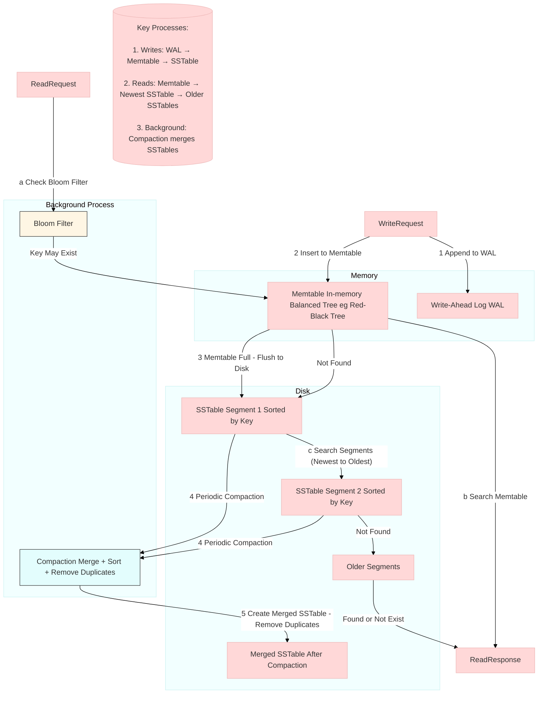
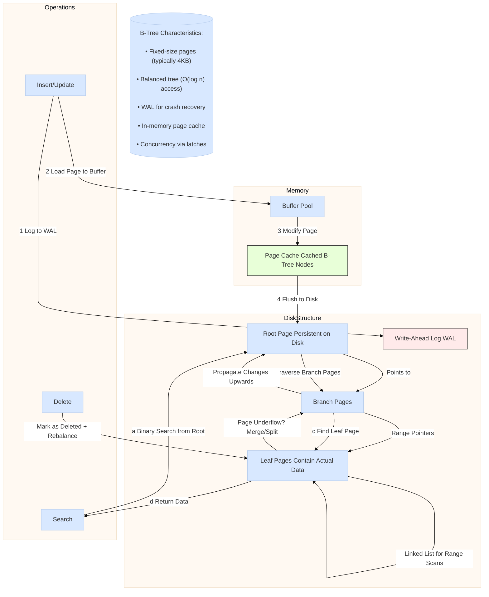

# Data Structures That Power Your Database
## 1. Fundamental Database Operations  
Databases must:  
- Store data durably when inserted or updated.  
- Retrieve data efficiently when queried.  

Key Insight:  
- Indexes accelerate reads but slow down writes (trade-off).  
- Storage engines are optimized for different workloads (OLTP vs. analytics).  

---

## 2. Simple Key-Value Storage & Indexing  

### (A) Append-Only Log  
- Write: Fast (append-only).  
- Read: Slow (O(n) scan).  
- Example:  
  ```bash
  db_set() { echo "$1,$2" >> database; }
  db_get() { grep "^$1," database | tail -n 1; }
  ```

### (B) Hash Index (Bitcask Model)  
- In-memory hash map maps keys to disk offsets.  
- Pros:  
  - Fast reads (O(1) lookup).  
  - High write throughput (sequential appends).  
- Cons:  
  - Entire key set must fit in RAM.  
  - No efficient range queries.  
- Optimizations:  
  - Segment files (break log into parts).  
  - Compaction (merge segments, discard duplicates).  
  - Crash recovery via snapshots.  

---
## 3. Log-Structured Storage: SSTables & LSM-Trees  

```
Examples: Cassendra, RiakDB
```



### Diagram Components Explained

1. Write Path (Red Arrows)
   - Incoming writes first go to the Write-Ahead Log (WAL) for crash recovery.
   - Then inserted into the Memtable (in-memory sorted structure).
   - When Memtable reaches size threshold, it's flushed to disk as an SSTable Segment.

2. Read Path (Blue Arrows)
   - Queries first check the Bloom Filter (quickly filters non-existent keys).
   - Search order: Memtable → Newest SSTable → Older SSTables (last write wins).
   - Sparse in-memory index enables binary search within SSTables.

3. Compaction Process (Green Box)
   - Merges multiple SSTables into one (like mergesort).
   - Key Benefits:
     - Removes duplicate keys (keeps only latest value).
     - Reduces disk space and improves read performance.
   - Runs in background without blocking writes.

1. Optimisations
   - Bloom Filter: Avoids unnecessary disk reads for non-existent keys.
   - Sorted SSTables: Enable efficient range scans and compression.
   - WAL: Ensures durability before writes are applied to Memtable.

### Key Advantages of LSM-Trees
- ✔ High Write Throughput: Sequential disk writes (no random updates).
- ✔ Efficient Compaction: Merging sorted files is CPU-friendly.
- ✔ Tunable Performance: Size-tiered vs. leveled compaction trade-offs.

---

## 4. B-Trees: The Industry Standard  
```
Examples: MySQL, PostgreSQL
```
### (A) Structure  
- Fixed-size pages (e.g., 4KB).  
- Balanced tree (fanout ~500 → depth of 3-4 for 256TB).  
- Operations:  
  - Insert/Split: May require rewriting multiple pages.  
  - Delete: Rebalance tree (complex but manageable).  
![[btree.png]]
### (B) Durability & Concurrency  
- Write-Ahead Log (WAL) ensures crash recovery.  
- Latches/locks for multi-threaded access.  

### (C) Optimizations  
- Copy-on-write (LMDB, avoids locks).  
- Shortened keys (reduce page size).  
- Clustered indexes (store data in leaf nodes).  



---

## 5. LSM-Trees vs. B-Trees: A Detailed Comparison  

| Aspect              | LSM-Tree                               | B-Tree                        |     |
| ------------------- | -------------------------------------- | ----------------------------- | --- |
| Write Speed         | Faster (sequential writes)             | Slower (random writes + WAL)  |     |
| Read Speed          | Slower (check multiple SSTables)       | Faster (consistent structure) |     |
| Space Efficiency    | Better compression, less fragmentation | More fragmentation            |     |
| Write Amplification | High (compaction)                      | Moderate (page splits)        |     |
| Use Cases           | Write-heavy (logging, analytics)       | OLTP, strong consistency      |     |

Key Trade-offs:  
- LSM-Trees favor write throughput but suffer from compaction stalls.  
- B-Trees offer predictable read latency but slower writes.  

---

## 6. Advanced Indexing Techniques  

### (A) Secondary Indexes  
- Allow queries on non-primary keys (e.g., `user_id` index).  
- Can be implemented with B-Trees or LSM-Trees.  

### (B) Clustered vs. Covering Indexes  
- Clustered: Data stored directly in index (e.g., InnoDB primary key).  
- Covering: Index includes some columns (avoids heap lookup).  

### (C) Multi-Column & Spatial Indexes  
- Concatenated index (e.g., `(last_name, first_name)`).  
- R-trees for geospatial queries (PostGIS).

### (D) Full-Text Search (Fuzzy Indexes)  
- Edit distance (Lucene’s Levenshtein automaton).  
  ``Lucene engine (maintains Trie DS) is used in ElesticSearch
- Inverted indexes for document search.  

---

## 7. In-Memory Databases  
``Examples: Redis, MemSQL, VoltDB.  
- Pros:  
  - Avoid disk encoding overhead.  
  - Simpler data structures (e.g., Redis sets, queues).  
- Durability:  
  - Snapshots (periodic dumps).  
  - Log shipping (append-only log for recovery).  

---

## 8. Future Trends  
- Non-Volatile Memory (NVM): Could blur disk/memory distinction.  
- Hybrid designs: Anti-caching (evict cold data to disk).  

---

### Final Takeaways  
1. LSM-Trees excel in write-heavy, analytics workloads.  
2. B-Trees dominate OLTP, low-latency reads.  
3. Indexing strategy depends on access patterns (read vs. write ratio).  
4. Emerging storage tech (NVM, hybrid models) may reshape future DB designs.  