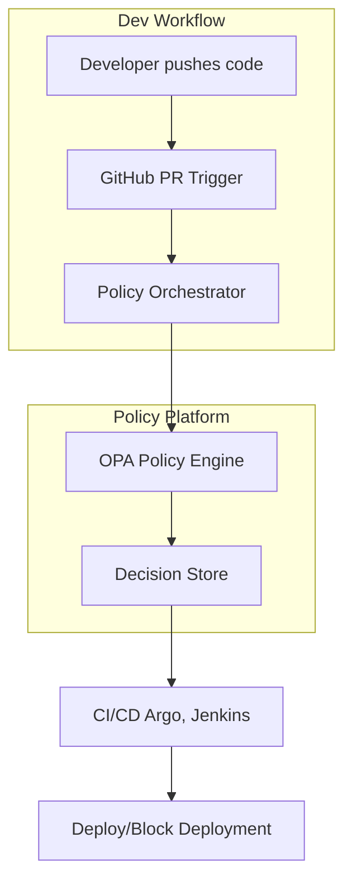
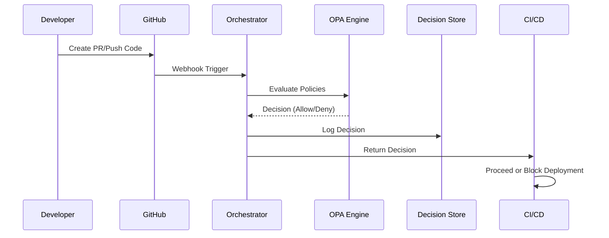
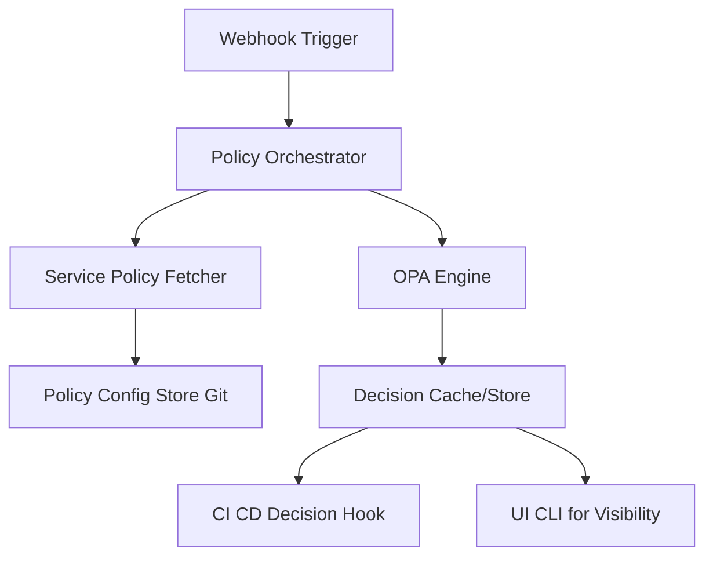

# 1) Requirements

## **Functional Requirements:**
- Automatically apply and enforce software delivery policies. (*For example: Ensure every production deployment includes a rollback strategy to prevent outages.*)
- Integrate with existing CI/CD pipelines (GitHub, Argo, etc.).
- Evaluate code/service deployment against defined rules.
- Provide visibility into policy violations and enforcement actions.
## **Non-Functional Requirements:**
- High reliability and availability.
- Low latency in policy evaluation.
- Scalable to thousands of services and deployments.
- Secure, auditable, and extensible.

---

# 2) Design Overview

The platform works as a **policy-as-code system** that evaluates delivery workflows through a central policy engine, with configurations stored in Git and decisions enforced in CI/CD systems.

**Key Components:**

- **Policy Engine (OPA-based)**: Evaluates rules written in Rego.
- **Policy Orchestrator**: Coordinates policy evaluations across the pipeline.
- **Integrations**: GitHub, Argo, CI/CD tools.
- **Decision Store**: Central place to store policy results and logs.
- **UI/CLI**: For developers to view, debug, and update policies.

---

# 3) High-Level Design Discussion

- The orchestrator fetches service-specific policies and invokes the OPA engine.
    
- OPA evaluates the Rego rules and returns decisions.
    
- Decisions are stored and optionally visualized.
    
- CI/CD pipelines act based on decisions.
    

---

# 4) Flow Diagram Discussion

This flow demonstrates a typical pull request or deployment event triggering the policy automation pipeline.

---

# 5) Low-Level Design Discussion

Here’s a breakdown of the policy evaluation engine architecture.

- **Policy Fetcher** loads the service-level Rego policies.
- **OPA Engine** evaluates them dynamically.
- **Decision Cache** helps in reusing evaluations and logs for audit/debugging.
- **UI/CLI** enables observability for developers and SREs.

---

# 6) Conclusion

The Policy Automation Platform enables organizations to balance development velocity with reliability by enforcing consistent standards during software delivery. With modular integrations and a policy-as-code approach, this system offers scalable, secure, and transparent governance in CI/CD workflows.