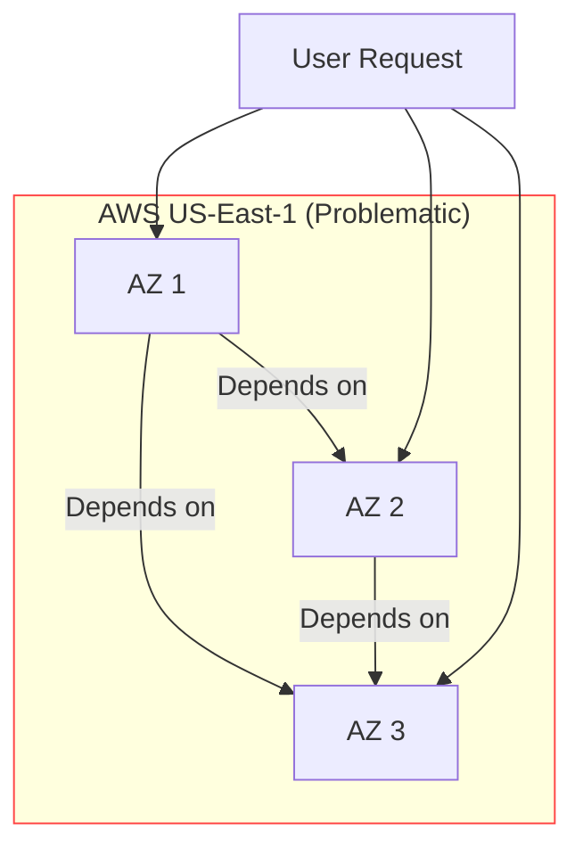
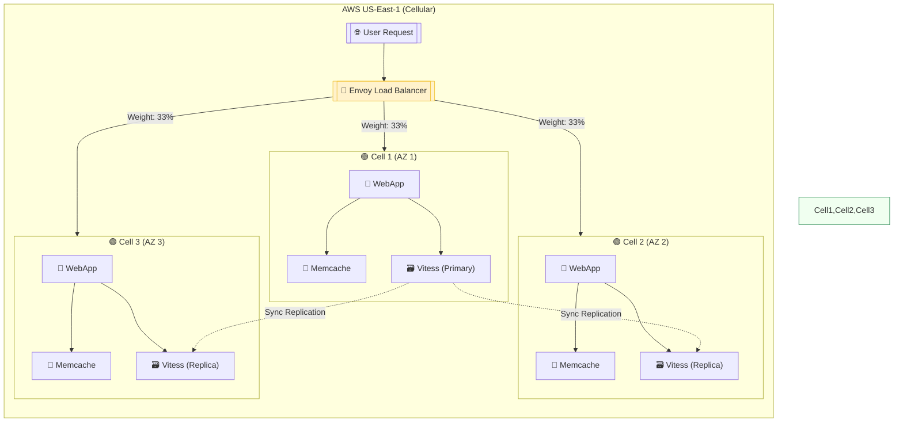
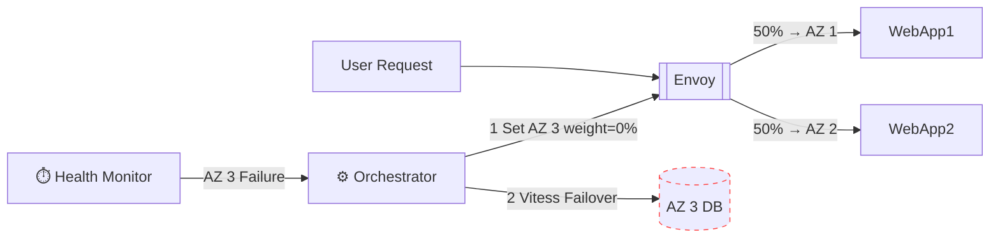
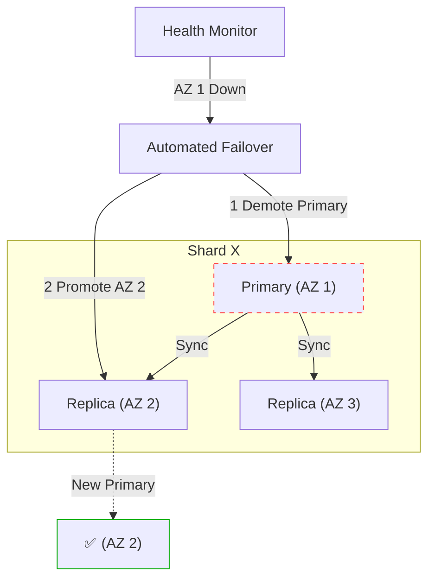
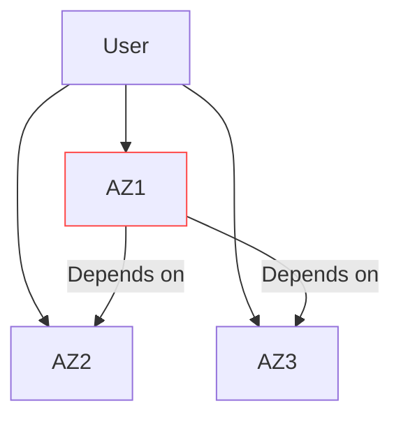
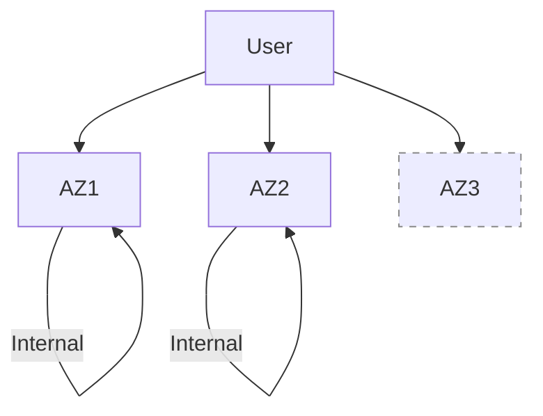
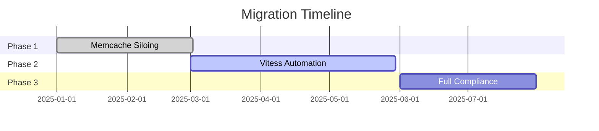

#  Introduction
## **1.1 Problem Statement**  
Slack’s monolithic architecture in AWS US-East-1 suffered from:  
- **Cascading failures**: Outages in one Availability Zone (AZ) impacted all AZs due to cross-AZ dependencies.  
- **Slow recovery**: Manual intervention required to mitigate AZ failures.  
- **SLO risks**: Inability to quickly drain traffic from failing AZs hurt reliability (99.99% uptime target).  

## **1.2 Solution Overview**  
Migrated to a **cellular architecture** where:  
- Each AZ operates as an independent **cell** with localized services.  
- **Traffic siloing**: 90%+ of requests are served within the same AZ.  
- **Automated AZ draining**: Failed cells are removed from service in <5 minutes.  

---

# Architectural Diagrams
## **2.1 Old Architecture (Monolithic)**  
**Problem**: Tight coupling across AZs caused failure propagation.  


**Key Issues**:  
- **Vitess DB**: Primary-replica relationships spanned AZs.  
- **Memcache**: Inconsistent hashing led to cache misses during AZ failures.
- **No isolation**: A failing AZ degraded performance globally.  

---

## 2.2 New Architecture (Cellular)
**Design Principles**:  
- **Cell = AZ**: Each cell has its own WebApp, cache, and database replicas.  
- **Envoy-weighted routing**: Traffic distributed evenly (33%/cell) during normal ops.  
- **Localized dependencies**: Services prefer same-cell resources.  



---

## 2.3 Data Flow During AZ Drain
**Process**:  
1. Health Monitor detects AZ failure.  
2. Orchestrator updates Envoy weights (0% to failed AZ).  
3. Vitess fails over replicas automatically.  



---

## 2.4 Vitess Database Failover
**Strong Consistency Requirement**:  
- Only one primary shard per dataset.
- Automated reparenting during AZ drains.



---

# Detailed Flow Discussion
### **Old Architecture Flow (Monolithic)**
#### **Request Flow**
1. **User Request**  
   - Hits AWS Global Accelerator → Routes to nearest edge POP.  
   - Terminates SSL at edge, establishes WebSocket to US-East-1.

2. **Cross-AZ Dependencies**  
   ```mermaid
   flowchart TD
       User --> Envoy
       Envoy -->|33%| WebApp1[WebApp AZ1]
       Envoy -->|33%| WebApp2[WebApp AZ2]
       Envoy -->|33%| WebApp3[WebApp AZ3]
       WebApp1 -->|"Cross-AZ call"| DB2[(DB AZ2)]
       WebApp2 -->|"Cross-AZ call"| Cache3[(Memcache AZ3)]
   ```
   - **Problem**: WebApp in AZ1 might call DB in AZ2 or Memcache in AZ3.

3. **Failure Propagation**  
   - AZ1 network outage → WebApp1 fails → Retries flood AZ2/AZ3.  
   - Vitess primary in AZ1 → Replicas in AZ2/AZ3 stale until manual failover.

#### **Key Flaws**
- **Memcache Inconsistency**:  
  - Clients in different AZs hashed to different nodes → cache misses.  
  - Increased DB load during AZ failures.
- **No Isolation**:  
  - 70% of requests relied on cross-AZ services.  
  - AZ drain impossible without breaking SLOs.

---

### **New Architecture Flow (Cellular)**
#### **Normal Operation**
1. **Traffic Routing**  
   - Envoy uses **weighted load balancing** (33% per AZ).  
   - Services prefer local-cell resources:  
   ```mermaid
   flowchart TD
       User --> Envoy
       Envoy -->|33%| Cell1[Cell1 AZ1]
       Envoy -->|33%| Cell2[Cell2 AZ2]
       Envoy -->|33%| Cell3[Cell3 AZ3]
       subgraph Cell1
           WebApp1 --> Cache1[(Memcache AZ1)]
           WebApp1 --> DB1[(Vitess AZ1)]
       end
   ```
   - **WebApp** → **Local Memcache** (99% hit rate).  
   - **Vitess**: Reads from local replica; writes route to primary shard’s AZ.

2. **Data Replication**  
   - **Vitess**: Async cross-AZ sync (2s RPO).  
   - **Memcache**: Cold start from DB if local cache empty.

#### **AZ Failure Response**
1. **Detection**  
   - Health monitor observes AZ3 latency spike → triggers orchestrator.

2. **Drain Process**  
   ```mermaid
   flowchart LR
       Monitor -->|AZ3 unhealthy| Orchestrator
       Orchestrator -->|1 Envoy: AZ3 = 0%| Envoy
       Orchestrator -->|2 Vitess: Reparent AZ2| DB3[(AZ3 DB)]
       Envoy -->|50% AZ1| WebApp1
       Envoy -->|50% AZ2| WebApp2
   ```
   - **Envoy**: Stops routing traffic to AZ3 in <10s.  
   - **Vitess**: Automated failover promotes AZ2 replica → primary (30s max).  

3. **Post-Failover**  
   - AZ1/AZ2 absorb traffic (validated via capacity planning).  
   - AZ3 services remain offline until root cause fixed.

---

### **Key Differences**
| **Aspect**               | **Old Flow**                          | **New Flow**                          |
|--------------------------|---------------------------------------|---------------------------------------|
| **Traffic Routing**       | Cross-AZ by default                   | Strictly intra-cell (90%+ traffic)    |
| **Failure Recovery**      | Manual (30+ mins)                     | Automated (<5 mins)                   |
| **Memcache**             | Global ring → cache misses            | Per-cell → consistent local cache     |
| **Vitess Writes**        | Primary in single AZ                  | Primary migrates during drains        |
| **Deployments**          | All AZs simultaneously                | AZ-by-AZ (safe rollback)              |

---

### **Technical Deep Dive**
#### **Envoy Configuration**
```yaml
# Example weighted cluster
clusters:
- name: cell1
  lb_policy: WEIGHTED
  endpoints:
  - address: webapp.cell1.svc
    weight: 33
- name: cell2
  endpoints:
  - address: webapp.cell2.svc
    weight: 33
# Health-based drain trigger
health_checks:
  timeout: 1s
  unhealthy_threshold: 3
```

#### **Vitess Failover Logic**
```go
func handleAZFailure(az string) {
  demotePrimary(az)
  promoteReplica(nextHealthyAZ(az))
  updateTopology() // Update global shard map
}
```

#### **Metrics Improvement**
- **Error Rate**: 1% → 0.1% during AZ outages.  
- **Recovery Time**: 30min → 2min (p99).  

---

### **Visual Summary**
**Before (Monolithic)**:  


**After (Cellular)**:  



---
# Implementation Details
## 3.1 Migration Strategy

| **Phase**        | **Timeline** | **Work**                                 |     |
| ---------------- | ------------ | ---------------------------------------- | --- |
| 1. Pilot         | Q1 2025      | Silo non-stateful services (Memcache)    |     |
| 2. Core Services | Q2 2025      | Vitess automation, Envoy traffic control |     |
| 3. Full Rollout  | Q3 2025      | All services cellularized                |     |



## **3.2 Key Components**  
1. **Envoy Proxy**:  
   - Weighted load balancing.  
   - Dynamic config via xDS API.  
2. **Vitess**:  
   - Per-shard primary election.  
   - Cross-AZ replication with 2s RPO.  
3. **Orchestrator**:  
   - Coordinates drains and failovers.  
   - Validates capacity before rerouting traffic.  

---
# Results

| **Metric**       | **Before** | **After** |     |
| ---------------- | ---------- | --------- | --- |
| AZ Drain Time    | >30 mins   | <5 mins   |     |
| Cross-AZ Traffic | 70%        | <10%      |     |
| SLO Compliance   | 99.9%      | 99.99%    |     |

**Operational Benefits**:  
- Blue-green deploys using AZ isolation.  
- 40% reduction in outage duration.  

---

# Lessons Learned
1. **Incremental Wins Matter**: Start with high-impact services.  
2. **Automate Early**: Manual failovers are unreliable.  
3. **Monitor Progress**: Weekly AZ drain tests built confidence.  

**Anti-Patterns Avoided**:  
- ❌ "Big bang" cutovers.  
- ❌ Ignoring team-specific constraints.  

--- 

